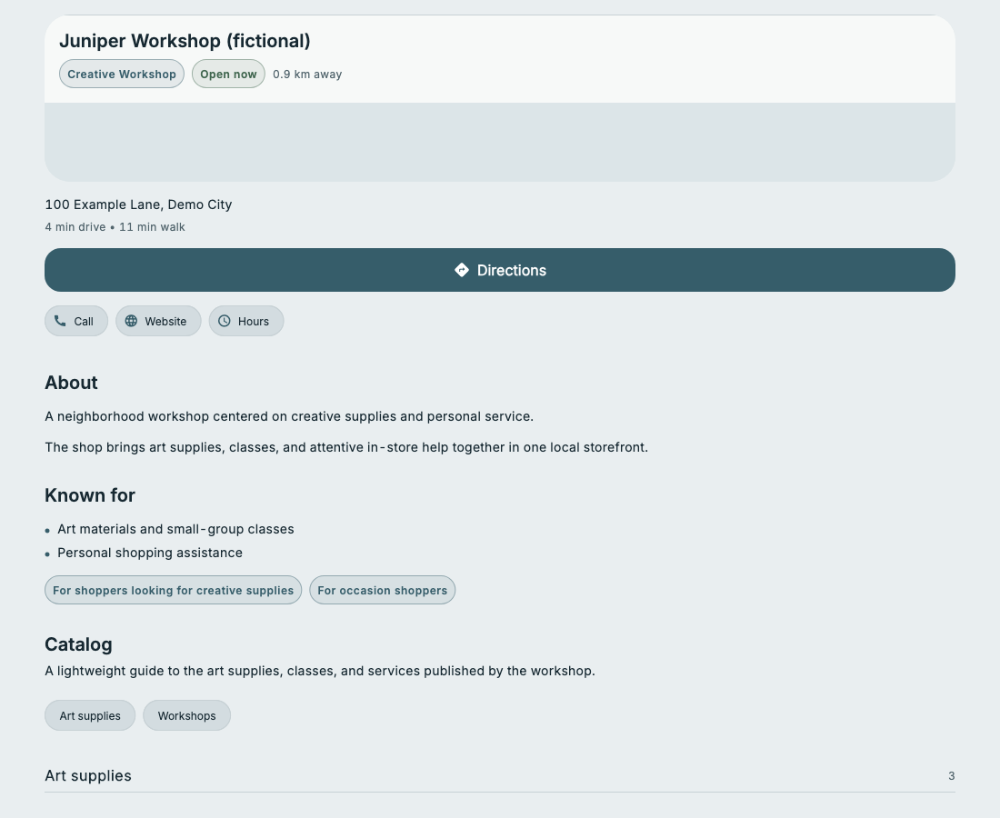
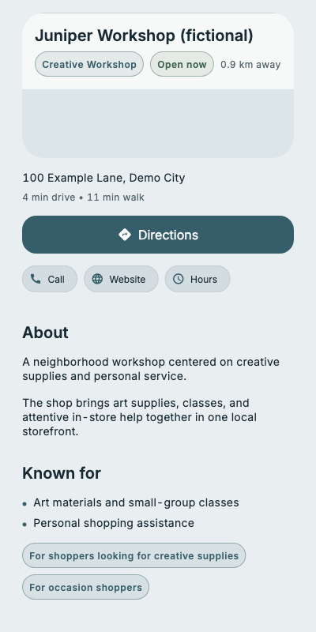
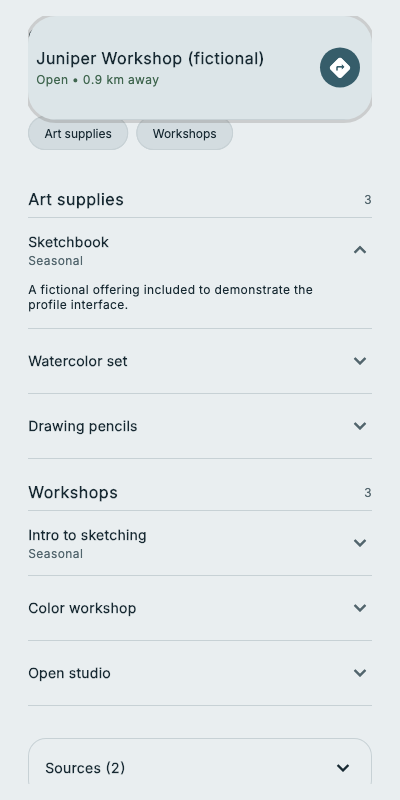

# NearMeWiki

**Explore nearby places through maps, useful profiles, and browsable catalogs.**

NearMeWiki is a local discovery prototype that brings business information into a map-first interface. Search for a place or an offering, explore catalog sections, and open a profile with practical details and source links.

This repository presents the product and its architecture. The screenshots render the actual profile UI using a fictional business. The implementation and research pipeline are maintained privately.

## Product tour

| Experience | What it helps people do |
| --- | --- |
| Map and search | Find places and offerings in a geographic context. |
| Business profiles | Read an overview, browse a catalog, and access hours, directions, website, and phone actions. |
| Discover | Browse offerings across businesses through catalog sections. |
| Source disclosure | Inspect the source links associated with a profile. |
| Research progress | Follow the progression from selecting a place to preparing a profile. |

Read the [feature tour](docs/feature-tour.md), explore the [architecture](docs/architecture.md), or inspect a [fictional example](examples/fictional-business.json).

## Responsive profile experience

These are component captures, not a recording of a running map or a hosted service. See the [capture notes](docs/capture-notes.md) for provenance and coverage.

## Engineering approach

- Flutter presents the map, search, discovery, and profile views.
- A Python/FastAPI service serves structured business information from PostgreSQL.
- A separate research workflow prepares structured profiles with source references and validation.
- Text facts and media have separate review paths; prototype availability does not establish publication rights.

## Status and scope

NearMeWiki is a prototype. This presentation does not offer a public API, hosted demo, or runnable application. All business details in the included examples and screenshots are fictional; `example.com` links are illustrative.

The public material intentionally stops at product behavior and a high-level architecture. Internal prompts, algorithms, evaluation results, datasets, provider configuration, and development history are outside this repository.
