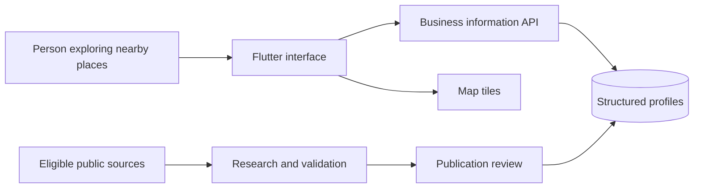

# Architecture overview

NearMeWiki separates the experience of browsing places from the work of researching and preparing their profiles.

The interface organizes information into maps, search results, discovery feeds, and business profiles. The service supplies structured records rather than asking the interface to interpret raw research output.

The research workflow gathers eligible source information and prepares independently written profile facts with provenance. Validation and publication review are separate responsibilities. Media is considered separately from text facts, and prototype media is not automatically cleared for wider publication.

The implementation uses Flutter, Python/FastAPI, PostgreSQL, and a map tile service. This diagram deliberately abstracts internal orchestration, decision rules, schemas, prompts, evaluation methods, and provider configuration.
