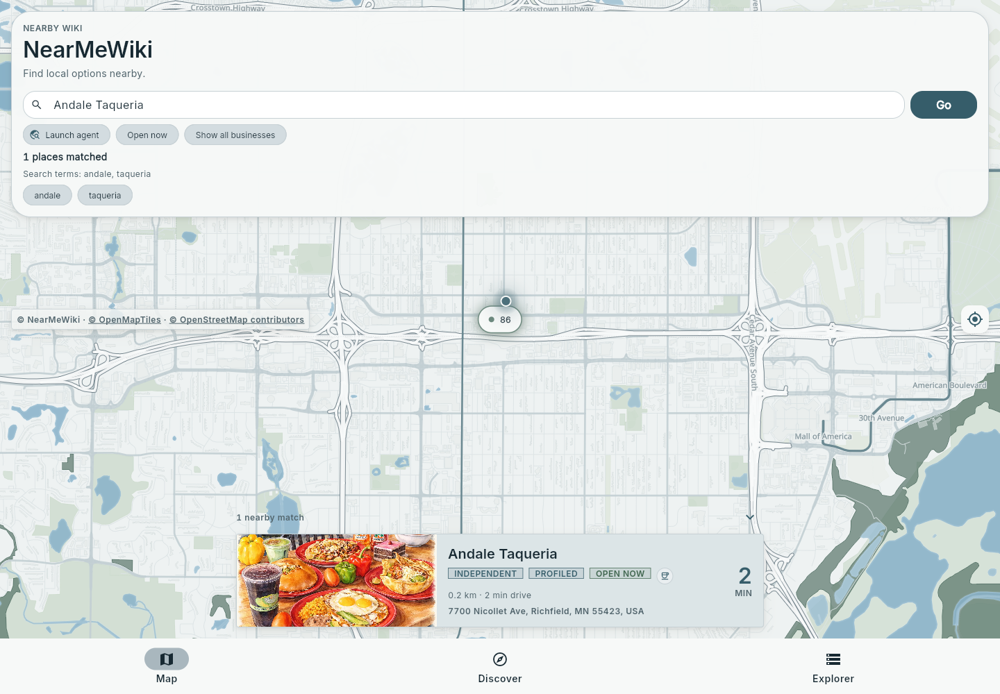

# Feature tour

## 1. Find a place or an offering

Map search connects a query to nearby businesses. Proximity-ranked results, local vector map tiles, and custom category badges provide instant geographic context.

## 2. Understand a business

A profile combines practical details, an overview, and an organized catalog. Directions, phone, website, and hours actions sit near the top so people can move smoothly from discovery to a next step.

## 3. Explore the catalog

Section controls make extensive menus and service catalogs easy to navigate. Expanding an individual offering reveals descriptions and details while maintaining the surrounding section context.

## 4. Browse across places

Discover organizes offerings into a curated feed of catalog sections across multiple local spots. It provides an intuitive way into business profiles when someone wants to browse what's nearby rather than search for a specific name.

## 5. Inspect sources and confidence

Profiles surface structured source disclosure. The platform includes place-selection, source-policy filtering, and automated validation pipelines before catalog ingestion.
