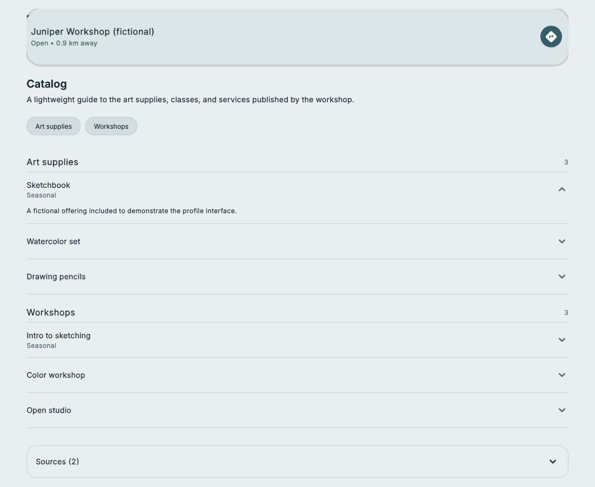

# Feature tour

## 1. Find a place or an offering

Map search connects a query to nearby businesses. Suggestions can point toward businesses, catalog sections, or individual offerings. Map position provides geographic context.

## 2. Understand a business

A profile combines practical details, an overview, and a catalog. Directions, phone, website, and hours actions sit near the top so people can move from discovery to a next step.

## 3. Explore the catalog

Section controls make longer catalogs easier to navigate. Expanding an item reveals its description while retaining the surrounding catalog context.

## 4. Browse across places

Discover organizes offerings into a feed of catalog sections. It provides another way into business profiles when someone wants to browse rather than begin with a specific business name.

## 5. Inspect sources and progress

Profiles provide source disclosure. The prototype also includes a place-selection and research-progress experience, plus an explorer for inspecting profile information. These capabilities are described at a product level here; their internal operational views are not included in the public captures.

The screenshots cover the responsive profile and catalog states only. Map, Discover, location permissions, research execution, source expansion, and external contact actions are not demonstrated by this capture set.
